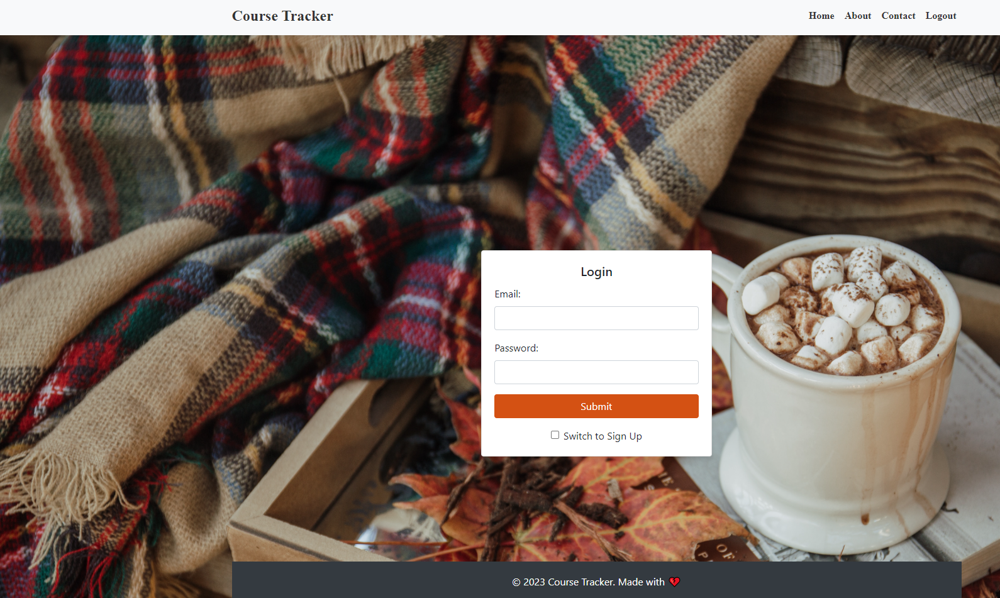

# Course Tracker

## Description
* This application is designed to help college students keep track of their progress through each semester. Add courses, assignments and notes to help organize your thoughts.

Screenshot of application

## Table of Contents
- [Description](#description)
- [Installation](#installation)
- [Usage](#usage)
- [License](#license)

## Installation
* This application requires node.js, handelbars.js and packages:
* express
* dotenv
* mysql
* sequelize 

## Usage
* Log into your mysql CLI and run "source db/schema.sql", then exit.
* Type "node server.js"

## License

A permissive license that allows users to do almost anything with the code as long as they provide attribution back to the author and don’t hold the author liable. This license is widely used for its simplicity and permissiveness.